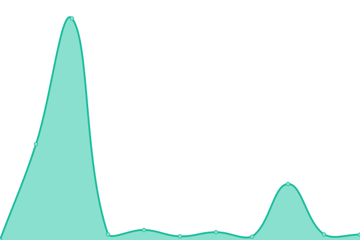
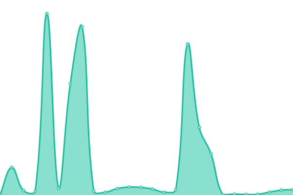

# [📈 Live Status](https://AlexDevUwU.github.io/quackhostuptimecheckerweb): <!--live status--> **🟩 All systems operational**

This repository contains the open-source uptime monitor and status page for [AlexDevUwU](https://AlexDevUwU.github.io/quackhostuptimecheckerweb), powered by [Upptime](https://github.com/upptime/upptime).

Con [Upptime](https://upptime.js.org), puedes crear webs como estas!
Si aparecen como "down" las 2 primeras webs, no pasa nada, puede ser que tengan una latencia alta o así. Es un bot, no es perfecto.

<!--start: status pages-->
<!-- This summary is generated by Upptime (https://github.com/upptime/upptime) -->
<!-- Do not edit this manually, your changes will be overwritten -->
<!-- prettier-ignore -->
| URL | Status | History | Response Time | Uptime |
| --- | ------ | ------- | ------------- | ------ |
|  [QuackHost Client](https://client.quackhost.uk/) | 🟩 Up | [quack-host-client.yml](https://github.com/AlexDevUwU/quackhostuptimecheckerweb/commits/HEAD/history/quack-host-client.yml) | 

 1257ms
     
 | 

<a href="https://AlexDevUwU.github.io/quackhostuptimecheckerweb/history/quack-host-client">38.85%</a>
    

|  [QuackHost GameCP](https://gamecp.quackhost.uk/) | 🟩 Up | [quack-host-game-cp.yml](https://github.com/AlexDevUwU/quackhostuptimecheckerweb/commits/HEAD/history/quack-host-game-cp.yml) | 

 6426ms
     
 | 

<a href="https://AlexDevUwU.github.io/quackhostuptimecheckerweb/history/quack-host-game-cp">32.92%</a>
    

|  [FIFR3 CPU API](http://95.217.226.152:26002/cpu) | 🟩 Up | [fifr-3-cpu-api.yml](https://github.com/AlexDevUwU/quackhostuptimecheckerweb/commits/HEAD/history/fifr-3-cpu-api.yml) | 

 1292ms
     
 | 

<a href="https://AlexDevUwU.github.io/quackhostuptimecheckerweb/history/fifr-3-cpu-api">100.00%</a>
    

|  [FIFR3 DISK API](http://95.217.226.152:26002/disk) | 🟩 Up | [fifr-3-disk-api.yml](https://github.com/AlexDevUwU/quackhostuptimecheckerweb/commits/HEAD/history/fifr-3-disk-api.yml) | 

 138ms
     
 | 

<a href="https://AlexDevUwU.github.io/quackhostuptimecheckerweb/history/fifr-3-disk-api">100.00%</a>
    

|  [FIFR3 RAM API](http://95.217.226.152:26002/ram) | 🟩 Up | [fifr-3-ram-api.yml](https://github.com/AlexDevUwU/quackhostuptimecheckerweb/commits/HEAD/history/fifr-3-ram-api.yml) | 

 139ms
     
 | 

<a href="https://AlexDevUwU.github.io/quackhostuptimecheckerweb/history/fifr-3-ram-api">100.00%</a>
    

<!--end: status pages-->

[**Visit our status website →**](https://AlexDevUwU.github.io/quackhostuptimecheckerweb)

## 📄 License

- Powered by: [Upptime](https://github.com/upptime/upptime)
- Code: [MIT](./LICENSE) © [AlexDevUwU](https://AlexDevUwU.github.io/quackhostuptimecheckerweb)
- Data in the `./history` directory: [Open Database License](https://opendatacommons.org/licenses/odbl/1-0/)
